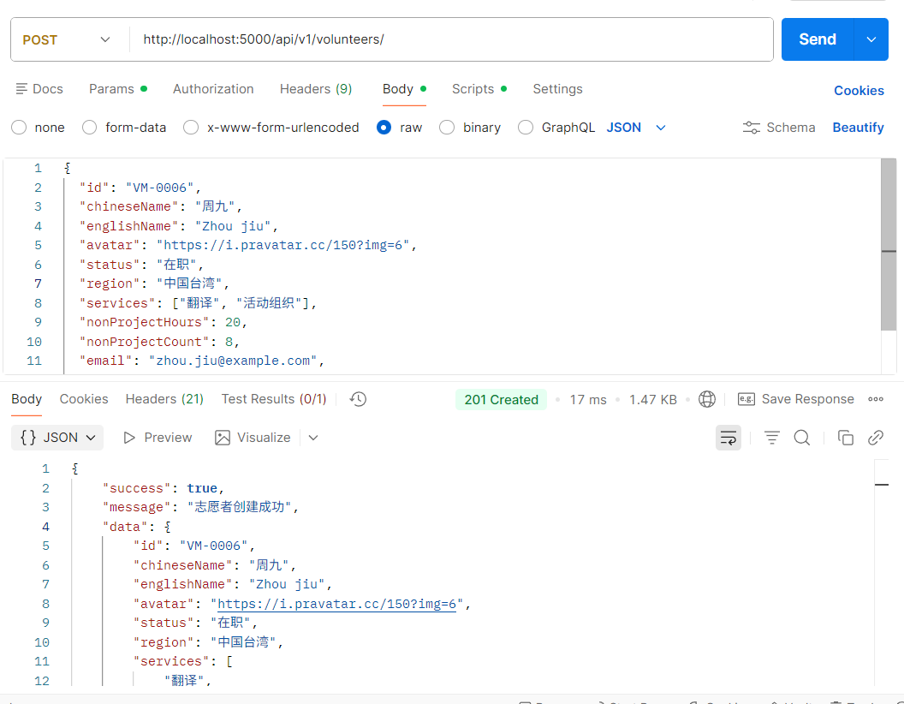

# 🚀 第二阶段：后端开发（数据层 + API）

- [🚀 第二阶段：后端开发（数据层 + API）](#-第二阶段后端开发数据层--api)
  - [📊 第一步：数据库设计](#-第一步数据库设计)
    - [1.1 创建Mongoose Schema](#11-创建mongoose-schema)
    - [1.2 创建数据库连接工具](#12-创建数据库连接工具)
  - [🛠️ 第二步：API开发](#️-第二步api开发)
    - [2.1 创建控制器](#21-创建控制器)
    - [2.2 创建路由](#22-创建路由)
    - [2.3 创建中间件](#23-创建中间件)
    - [2.4 更新主服务器文件](#24-更新主服务器文件)
    - [2.5 安装额外的依赖](#25-安装额外的依赖)
  - [📝 第三步：数据初始化](#-第三步数据初始化)
    - [3.1 创建种子数据生成器](#31-创建种子数据生成器)
    - [3.2 创建数据导出文件](#32-创建数据导出文件)
    - [3.3 更新package.json脚本](#33-更新packagejson脚本)
  - [🧪 第四步：测试API](#-第四步测试api)
  - [🚀 第五步：安装依赖并运行](#-第五步安装依赖并运行)
  - [✅ 第二阶段完成检查清单](#-第二阶段完成检查清单)
  - [📡 测试API端点](#-测试api端点)
  - [🧠理解](#理解)
    - [餐厅类比（让架构更清晰）](#餐厅类比让架构更清晰)
    - [举个具体例子（把比喻落地）](#举个具体例子把比喻落地)
  - [🎯 下一步准备](#-下一步准备)
  - [参考AI对话](#参考ai对话)

## 📊 第一步：数据库设计

### 1.1 创建Mongoose Schema

**backend/src/models/Volunteer.js:**

```javascript
import mongoose from 'mongoose';

const volunteerSchema = new mongoose.Schema({
  // 基本信息
  id: {
    type: String,
    required: [true, '志愿者ID是必需的'],
    unique: true,
    trim: true,
    match: [/^VM-\d{4}$/, 'ID格式必须是 VM-xxxx']
  },
  chineseName: {
    type: String,
    required: [true, '中文姓名是必需的'],
    trim: true,
    minlength: [2, '中文姓名至少2个字符'],
    maxlength: [50, '中文姓名最多50个字符']
  },
  englishName: {
    type: String,
    required: [true, '英文姓名是必需的'],
    trim: true,
    minlength: [2, '英文姓名至少2个字符'],
    maxlength: [100, '英文姓名最多100个字符']
  },
  avatar: {
    type: String,
    default: 'https://ui-avatars.com/api/?name=Unknown&background=random',
    trim: true
  },
  
  // 状态和地区
  status: {
    type: String,
    required: true,
    enum: {
      values: ['在职', '不在职'],
      message: '状态必须是"在职"或"不在职"'
    },
    default: '在职'
  },
  region: {
    type: String,
    required: [true, '地区是必需的'],
    trim: true,
    enum: ['中国大陆', '中国台湾', '东南亚', '美国', '欧洲', '其他']
  },
  
  // 服务信息
  services: {
    type: [String],
    required: [true, '至少选择一个服务方向'],
    validate: {
      validator: function(v) {
        return v.length > 0 && v.length <= 5;
      },
      message: '服务方向至少1个，最多5个'
    },
    enum: ['翻译', '校对', '管理', '技术', '培训', '社区服务', '活动组织', '其他']
  },
  
  // 非项目服务统计
  nonProjectHours: {
    type: Number,
    required: [true, '非项目服务时长是必需的'],
    min: [0, '时长不能为负数'],
    default: 0
  },
  nonProjectCount: {
    type: Number,
    required: [true, '非项目服务次数是必需的'],
    min: [0, '次数不能为负数'],
    default: 0
  },
  
  // 扩展信息（可选）
  email: {
    type: String,
    trim: true,
    lowercase: true,
    match: [/^\S+@\S+\.\S+$/, '请输入有效的邮箱地址']
  },
  phone: {
    type: String,
    trim: true,
    match: [/^[+]?[\d\s\-()]{10,20}$/, '请输入有效的电话号码']
  },
  joinDate: {
    type: Date,
    default: Date.now
  },
  
  // 元数据
  isActive: {
    type: Boolean,
    default: true
  },
  createdAt: {
    type: Date,
    default: Date.now
  },
  updatedAt: {
    type: Date,
    default: Date.now
  }
}, {
  timestamps: { 
    createdAt: 'createdAt',
    updatedAt: 'updatedAt' 
  }
});

// 添加索引
volunteerSchema.index({ id: 1 }); // 唯一索引（自动创建）
volunteerSchema.index({ status: 1 });
volunteerSchema.index({ region: 1 });
volunteerSchema.index({ services: 1 });
volunteerSchema.index({ createdAt: -1 });
volunteerSchema.index({ nonProjectHours: -1 });

// 更新updatedAt时间戳的中间件
volunteerSchema.pre('save', function(next) {
  this.updatedAt = Date.now();
  next();
});

// 静态方法
volunteerSchema.statics.findByRegion = function(region) {
  return this.find({ region });
};

volunteerSchema.statics.findActive = function() {
  return this.find({ status: '在职', isActive: true });
};

// 实例方法
volunteerSchema.methods.getSummary = function() {
  return {
    id: this.id,
    name: this.chineseName,
    status: this.status,
    region: this.region,
    services: this.services,
    hours: this.nonProjectHours
  };
};

const Volunteer = mongoose.model('Volunteer', volunteerSchema);

export default Volunteer;
```

### 1.2 创建数据库连接工具

**backend/src/utils/database.js:**

```javascript
import mongoose from 'mongoose';
import dotenv from 'dotenv';

dotenv.config();

class Database {
  constructor() {
    this._connect();
  }

  _connect() {
    const MONGODB_URI = process.env.MONGODB_URI || 'mongodb://localhost:27017/volunteer_demo';
    
    mongoose.connect(MONGODB_URI, {
      useNewUrlParser: true,
      useUnifiedTopology: true,
      serverSelectionTimeoutMS: 5000,
      socketTimeoutMS: 45000,
    })
    .then(() => {
      console.log('✅ MongoDB连接成功');
      console.log(`📊 数据库: ${mongoose.connection.db.databaseName}`);
    })
    .catch(err => {
      console.error('❌ MongoDB连接失败:', err.message);
      console.log('⚠️  请确保MongoDB服务正在运行');
      console.log('📌 启动MongoDB命令: mongod --dbpath=/path/to/data');
      process.exit(1);
    });

    // 连接事件监听
    mongoose.connection.on('connected', () => {
      console.log('📡 MongoDB已连接');
    });

    mongoose.connection.on('error', (err) => {
      console.error('❌ MongoDB连接错误:', err);
    });

    mongoose.connection.on('disconnected', () => {
      console.log('⚠️  MongoDB连接断开');
    });

    // 应用终止时关闭连接
    process.on('SIGINT', async () => {
      await mongoose.connection.close();
      console.log('👋 MongoDB连接已关闭');
      process.exit(0);
    });
  }
}

export default new Database();
```

## 🛠️ 第二步：API开发

### 2.1 创建控制器

**backend/src/controllers/volunteerController.js:**

```javascript
import Volunteer from '../models/Volunteer.js';

// 获取所有志愿者
export const getAllVolunteers = async (req, res) => {
  try {
    const {
      status,
      region,
      services,
      search,
      page = 1,
      limit = 20,
      sortBy = 'createdAt',
      order = 'desc'
    } = req.query;

    // 构建查询条件
    let query = {};

    // 状态筛选
    if (status && ['在职', '不在职'].includes(status)) {
      query.status = status;
    }

    // 地区筛选
    if (region) {
      query.region = region;
    }

    // 服务方向筛选
    if (services) {
      const servicesArray = services.split(',');
      query.services = { $in: servicesArray };
    }

    // 搜索（姓名或ID）
    if (search) {
      query.$or = [
        { chineseName: { $regex: search, $options: 'i' } },
        { englishName: { $regex: search, $options: 'i' } },
        { id: { $regex: search, $options: 'i' } }
      ];
    }

    // 排序
    const sortOptions = {};
    sortOptions[sortBy] = order === 'desc' ? -1 : 1;

    // 分页
    const skip = (parseInt(page) - 1) * parseInt(limit);
    const total = await Volunteer.countDocuments(query);
    const volunteers = await Volunteer.find(query)
      .sort(sortOptions)
      .skip(skip)
      .limit(parseInt(limit))
      .select('-__v -isActive'); // 排除不必要字段

    res.status(200).json({
      success: true,
      count: volunteers.length,
      total,
      totalPages: Math.ceil(total / parseInt(limit)),
      currentPage: parseInt(page),
      data: volunteers
    });
  } catch (error) {
    res.status(500).json({
      success: false,
      message: '获取志愿者列表失败',
      error: error.message
    });
  }
};

// 获取单个志愿者
export const getVolunteerById = async (req, res) => {
  try {
    const volunteer = await Volunteer.findOne({ id: req.params.id });
    
    if (!volunteer) {
      return res.status(404).json({
        success: false,
        message: `未找到ID为 ${req.params.id} 的志愿者`
      });
    }

    res.status(200).json({
      success: true,
      data: volunteer
    });
  } catch (error) {
    res.status(500).json({
      success: false,
      message: '获取志愿者信息失败',
      error: error.message
    });
  }
};

// 创建志愿者
export const createVolunteer = async (req, res) => {
  try {
    const existingVolunteer = await Volunteer.findOne({ id: req.body.id });
    if (existingVolunteer) {
      return res.status(400).json({
        success: false,
        message: `志愿者ID ${req.body.id} 已存在`
      });
    }

    const volunteer = await Volunteer.create(req.body);
    
    res.status(201).json({
      success: true,
      message: '志愿者创建成功',
      data: volunteer
    });
  } catch (error) {
    res.status(400).json({
      success: false,
      message: '创建志愿者失败',
      error: error.message
    });
  }
};

// 更新志愿者
export const updateVolunteer = async (req, res) => {
  try {
    const volunteer = await Volunteer.findOneAndUpdate(
      { id: req.params.id },
      req.body,
      {
        new: true,
        runValidators: true
      }
    );

    if (!volunteer) {
      return res.status(404).json({
        success: false,
        message: `未找到ID为 ${req.params.id} 的志愿者`
      });
    }

    res.status(200).json({
      success: true,
      message: '志愿者更新成功',
      data: volunteer
    });
  } catch (error) {
    res.status(400).json({
      success: false,
      message: '更新志愿者失败',
      error: error.message
    });
  }
};

// 删除志愿者
export const deleteVolunteer = async (req, res) => {
  try {
    const volunteer = await Volunteer.findOneAndDelete({ id: req.params.id });

    if (!volunteer) {
      return res.status(404).json({
        success: false,
        message: `未找到ID为 ${req.params.id} 的志愿者`
      });
    }

    res.status(200).json({
      success: true,
      message: '志愿者删除成功',
      data: volunteer
    });
  } catch (error) {
    res.status(500).json({
      success: false,
      message: '删除志愿者失败',
      error: error.message
    });
  }
};

// 获取统计信息
export const getVolunteerStats = async (req, res) => {
  try {
    const stats = await Volunteer.aggregate([
      {
        $group: {
          _id: null,
          totalVolunteers: { $sum: 1 },
          totalHours: { $sum: '$nonProjectHours' },
          totalActive: {
            $sum: { $cond: [{ $eq: ['$status', '在职'] }, 1, 0] }
          },
          totalInactive: {
            $sum: { $cond: [{ $eq: ['$status', '不在职'] }, 1, 0] }
          },
          avgHours: { $avg: '$nonProjectHours' }
        }
      },
      {
        $project: {
          _id: 0,
          totalVolunteers: 1,
          totalHours: 1,
          totalActive: 1,
          totalInactive: 1,
          avgHours: { $round: ['$avgHours', 2] }
        }
      }
    ]);

    // 地区分布
    const regionStats = await Volunteer.aggregate([
      {
        $group: {
          _id: '$region',
          count: { $sum: 1 },
          totalHours: { $sum: '$nonProjectHours' }
        }
      },
      {
        $project: {
          region: '$_id',
          count: 1,
          totalHours: 1,
          _id: 0
        }
      },
      { $sort: { count: -1 } }
    ]);

    // 服务方向分布
    const serviceStats = await Volunteer.aggregate([
      { $unwind: '$services' },
      {
        $group: {
          _id: '$services',
          count: { $sum: 1 }
        }
      },
      { $sort: { count: -1 } }
    ]);

    res.status(200).json({
      success: true,
      data: {
        summary: stats[0] || {
          totalVolunteers: 0,
          totalHours: 0,
          totalActive: 0,
          totalInactive: 0,
          avgHours: 0
        },
        regionDistribution: regionStats,
        serviceDistribution: serviceStats
      }
    });
  } catch (error) {
    res.status(500).json({
      success: false,
      message: '获取统计信息失败',
      error: error.message
    });
  }
};
```

### 2.2 创建路由

**backend/src/routes/volunteerRoutes.js:**

```javascript
import express from 'express';
import {
  getAllVolunteers,
  getVolunteerById,
  createVolunteer,
  updateVolunteer,
  deleteVolunteer,
  getVolunteerStats
} from '../controllers/volunteerController.js';

const router = express.Router();

// 志愿者路由
router.route('/')
  .get(getAllVolunteers)    // 获取所有志愿者
  .post(createVolunteer);   // 创建志愿者

router.route('/stats')
  .get(getVolunteerStats);  // 获取统计信息

router.route('/:id')
  .get(getVolunteerById)    // 获取单个志愿者
  .put(updateVolunteer)     // 更新志愿者
  .delete(deleteVolunteer); // 删除志愿者

export default router;
```

### 2.3 创建中间件

**backend/src/middleware/errorHandler.js:**

```javascript
// 404中间件
export const notFound = (req, res, next) => {
  const error = new Error(`未找到路由 - ${req.originalUrl}`);
  res.status(404);
  next(error);
};

// 全局错误处理中间件
export const errorHandler = (err, req, res, next) => {
  let statusCode = res.statusCode === 200 ? 500 : res.statusCode;
  let message = err.message;

  // Mongoose错误处理
  if (err.name === 'CastError') {
    message = '资源未找到';
    statusCode = 404;
  }

  if (err.name === 'ValidationError') {
    message = Object.values(err.errors).map(val => val.message).join(', ');
    statusCode = 400;
  }

  if (err.code === 11000) {
    message = '资源已存在';
    statusCode = 400;
  }

  res.status(statusCode).json({
    success: false,
    message,
    stack: process.env.NODE_ENV === 'production' ? null : err.stack,
    timestamp: new Date().toISOString()
  });
};
```

### 2.4 更新主服务器文件

**backend/src/server.js:**

```javascript
import express from 'express';
import cors from 'cors';
import dotenv from 'dotenv';
import helmet from 'helmet';
import morgan from 'morgan';
import mongoose from 'mongoose';  // 导入 mongoose

import database from './utils/database.js';
import volunteerRoutes from './routes/volunteerRoutes.js';
import { notFound, errorHandler } from './middleware/errorHandler.js';

// 加载环境变量
dotenv.config();

const app = express();
const PORT = process.env.PORT || 5000;

// 连接数据库
database;

// 安全中间件
app.use(helmet());
app.use(cors({
  origin: process.env.CORS_ORIGIN || 'http://localhost:3000',
  credentials: true
}));

// 日志中间件
app.use(morgan('dev'));

// 解析请求体
app.use(express.json());
app.use(express.urlencoded({ extended: true }));

// API路由
app.use('/api/v1/volunteers', volunteerRoutes);

// 健康检查 - 修复这里
app.get('/api/health', (req, res) => {
  res.json({
    status: 'ok',
    message: '志愿者管理系统API正常运行',
    timestamp: new Date().toISOString(),
    environment: process.env.NODE_ENV,
    mongodb: mongoose.connection.readyState === 1 ? 'connected' : 'disconnected'
  });
});

// 根路由
app.get('/', (req, res) => {
  res.send(`
    <!DOCTYPE html>
    <html>
    <head>
      <title>Volunteer Tracker API</title>
      <style>
        body { font-family: Arial, sans-serif; padding: 40px; max-width: 800px; margin: 0 auto; }
        .status { color: green; font-weight: bold; }
        .endpoint { background: #f5f5f5; padding: 10px; margin: 10px 0; border-radius: 5px; }
      </style>
    </head>
    <body>
      <h1>🚀 Volunteer Tracker Backend API</h1>
      <p class="status">✅ Server running on port ${PORT}</p>
      <p>MongoDB状态: ${mongoose.connection.readyState === 1 ? '已连接' : '未连接'}</p>
      <h2>📡 可用接口</h2>
      <div class="endpoint">
        <strong>GET /api/health</strong> - 健康检查
      </div>
      <div class="endpoint">
        <strong>GET /api/v1/volunteers</strong> - 获取所有志愿者
        <br><small>参数: ?status=在职&region=中国大陆&page=1&limit=20</small>
      </div>
      <div class="endpoint">
        <strong>GET /api/v1/volunteers/stats</strong> - 获取统计信息
      </div>
      <div class="endpoint">
        <strong>GET /api/v1/volunteers/:id</strong> - 获取单个志愿者
      </div>
    </body>
    </html>
  `);
});

// 404处理
app.use(notFound);

// 错误处理
app.use(errorHandler);

// 启动服务器
app.listen(PORT, () => {
  console.log(`🚀 服务器运行在端口 ${PORT}`);
  console.log(`📡 健康检查: http://localhost:${PORT}/api/health`);
  console.log(`📊 志愿者API: http://localhost:${PORT}/api/v1/volunteers`);
  console.log(`🌐 Web界面: http://localhost:${PORT}/`);
});
```

### 2.5 安装额外的依赖

```bash
cd backend
npm install helmet morgan
```

## 📝 第三步：数据初始化

### 3.1 创建种子数据生成器

**backend/src/utils/seedSimple.js:**

```javascript
import mongoose from 'mongoose';
import dotenv from 'dotenv';
import Volunteer from '../models/Volunteer.js';

dotenv.config();

const simpleVolunteers = [
  {
    id: "VM-0001",
    chineseName: "张三",
    englishName: "Zhang San",
    avatar: "https://i.pravatar.cc/150?img=1",
    status: "在职",
    region: "中国大陆",
    services: ["翻译", "管理"],
    nonProjectHours: 85,
    nonProjectCount: 32,
    email: "zhang.san@example.com",
    phone: "+86 13800138001"
  },
  {
    id: "VM-0002",
    chineseName: "李四",
    englishName: "Li Si",
    avatar: "https://i.pravatar.cc/150?img=2",
    status: "在职",
    region: "中国台湾",
    services: ["校对", "技术"],
    nonProjectHours: 120,
    nonProjectCount: 45,
    email: "li.si@example.com",
    phone: "+886 912345678"
  },
  {
    id: "VM-0003",
    chineseName: "王五",
    englishName: "Wang Wu",
    avatar: "https://i.pravatar.cc/150?img=3",
    status: "不在职",
    region: "东南亚",
    services: ["社区服务"],
    nonProjectHours: 65,
    nonProjectCount: 25,
    email: "wang.wu@example.com",
    phone: "+65 81234567"
  },
  {
    id: "VM-0004",
    chineseName: "赵六",
    englishName: "Zhao Liu",
    avatar: "https://i.pravatar.cc/150?img=4",
    status: "在职",
    region: "美国",
    services: ["培训", "翻译"],
    nonProjectHours: 150,
    nonProjectCount: 55,
    email: "zhao.liu@example.com",
    phone: "+1 2125550123"
  },
  {
    id: "VM-0005",
    chineseName: "孙七",
    englishName: "Sun Qi",
    avatar: "https://i.pravatar.cc/150?img=5",
    status: "在职",
    region: "欧洲",
    services: ["技术", "管理"],
    nonProjectHours: 95,
    nonProjectCount: 38,
    email: "sun.qi@example.com",
    phone: "+44 7911123456"
  }
];

const seedSimple = async () => {
  try {
    console.log('🌱 开始初始化简单数据库...');
    
    // 连接数据库
    await mongoose.connect(process.env.MONGODB_URI || 'mongodb://localhost:27017/volunteer_demo');
    
    // 删除现有数据
    await Volunteer.deleteMany({});
    console.log('🗑️  已清除现有数据');
    
    // 插入简单数据
    await Volunteer.insertMany(simpleVolunteers);
    console.log(`✅ 成功创建 ${simpleVolunteers.length} 条志愿者数据`);
    
    // 显示统计
    const total = await Volunteer.countDocuments();
    const active = await Volunteer.countDocuments({ status: '在职' });
    const totalHours = await Volunteer.aggregate([
      { $group: { _id: null, total: { $sum: '$nonProjectHours' } } }
    ]);
    
    console.log('\n📊 数据库统计:');
    console.log(`  总志愿者数: ${total}`);
    console.log(`  在职志愿者: ${active}`);
    console.log(`  非在职志愿者: ${total - active}`);
    console.log(`  总服务时长: ${totalHours[0]?.total || 0} 小时`);
    
    console.log('\n📋 所有志愿者:');
    const allVolunteers = await Volunteer.find({}).select('id chineseName englishName status region');
    allVolunteers.forEach(v => {
      console.log(`  ${v.id}: ${v.chineseName} (${v.englishName}) - ${v.status} - ${v.region}`);
    });
    
    console.log('\n🎉 数据库初始化完成！');
    process.exit(0);
  } catch (error) {
    console.error('❌ 数据库初始化失败:', error.message);
    console.error('错误详情:', error);
    process.exit(1);
  }
};

// 运行
seedSimple();
```

### 3.2 创建数据导出文件

**data/volunteers.json:**

```json
[
  {
    "id": "VM-0001",
    "chineseName": "张明",
    "englishName": "Zhang Ming",
    "avatar": "https://i.pravatar.cc/150?img=1",
    "status": "在职",
    "region": "中国大陆",
    "services": ["翻译", "管理"],
    "nonProjectHours": 85,
    "nonProjectCount": 32,
    "email": "zhang.ming@example.com",
    "phone": "+86 13800138001",
    "joinDate": "2023-06-15T00:00:00.000Z"
  },
  {
    "id": "VM-0002",
    "chineseName": "李娜",
    "englishName": "Li Na",
    "avatar": "https://i.pravatar.cc/150?img=2",
    "status": "在职",
    "region": "中国台湾",
    "services": ["校对", "技术"],
    "nonProjectHours": 120,
    "nonProjectCount": 45,
    "email": "li.na@example.com",
    "phone": "+886 912345678",
    "joinDate": "2023-05-20T00:00:00.000Z"
  },
  {
    "id": "VM-0003",
    "chineseName": "王伟",
    "englishName": "Wang Wei",
    "avatar": "https://i.pravatar.cc/150?img=3",
    "status": "不在职",
    "region": "东南亚",
    "services": ["社区服务", "活动组织"],
    "nonProjectHours": 65,
    "nonProjectCount": 25,
    "email": "wang.wei@example.com",
    "phone": "+65 81234567",
    "joinDate": "2023-03-10T00:00:00.000Z"
  },
  {
    "id": "VM-0004",
    "chineseName": "刘芳",
    "englishName": "Liu Fang",
    "avatar": "https://i.pravatar.cc/150?img=4",
    "status": "在职",
    "region": "美国",
    "services": ["培训", "翻译"],
    "nonProjectHours": 150,
    "nonProjectCount": 55,
    "email": "liu.fang@example.com",
    "phone": "+1 2125550123",
    "joinDate": "2023-08-05T00:00:00.000Z"
  },
  {
    "id": "VM-0005",
    "chineseName": "陈强",
    "englishName": "Chen Qiang",
    "avatar": "https://i.pravatar.cc/150?img=5",
    "status": "在职",
    "region": "欧洲",
    "services": ["技术", "管理"],
    "nonProjectHours": 95,
    "nonProjectCount": 38,
    "email": "chen.qiang@example.com",
    "phone": "+44 7911123456",
    "joinDate": "2023-09-12T00:00:00.000Z"
  }
]
```

### 3.3 更新package.json脚本

```json
{
  "scripts": {
    "start": "node src/server.js",
    "dev": "nodemon src/server.js",
    "seed": "node src/utils/seedSimple.js",
    "test": "node scripts/test-simple.js",
    "reset": "npm run seed",
    "lint": "eslint src/**/*.js",
    "format": "prettier --write \"src/**/*.js\""
  }
}
```

## 🧪 第四步：测试API

**backend/scripts/test-simple.js:**

```javascript
console.log('🧪 开始测试后端API连接...\n');

async function testAPI() {
  try {
    // 测试健康检查
    console.log('1. 测试健康检查...');
    const healthRes = await fetch('http://localhost:5000/api/health');
    if (!healthRes.ok) throw new Error(`HTTP ${healthRes.status}`);
    const healthData = await healthRes.json();
    console.log(`✅ ${healthData.message}`);
    console.log(`   MongoDB状态: ${healthData.mongodb}`);
    
    // 测试志愿者API
    console.log('\n2. 测试志愿者API...');
    const volunteersRes = await fetch('http://localhost:5000/api/v1/volunteers');
    if (!volunteersRes.ok) throw new Error(`HTTP ${volunteersRes.status}`);
    const volunteersData = await volunteersRes.json();
    
    console.log(`✅ 获取到 ${volunteersData.total} 位志愿者`);
    
    if (volunteersData.data && volunteersData.data.length > 0) {
      console.log('\n📋 志愿者列表:');
      volunteersData.data.forEach((volunteer, index) => {
        console.log(`  ${index + 1}. ${volunteer.id} - ${volunteer.chineseName}`);
        console.log(`     英文名: ${volunteer.englishName}`);
        console.log(`     状态: ${volunteer.status}, 地区: ${volunteer.region}`);
        console.log(`     服务方向: ${volunteer.services.join(', ')}`);
        console.log(`     服务时长: ${volunteer.nonProjectHours}小时 (${volunteer.nonProjectCount}次)\n`);
      });
    }
    
    console.log('🎉 API测试成功！');
    
  } catch (error) {
    console.error('\n❌ API测试失败:', error.message);
    console.log('\n💡 解决方案:');
    console.log('   1. 确保服务器运行: npm run dev');
    console.log('   2. 初始化数据库: npm run seed');
    console.log('   3. 检查MongoDB连接');
  }
}

// 等待服务器启动
setTimeout(() => {
  testAPI();
}, 2000);
```

## 🚀 第五步：安装依赖并运行

```bash
# 在backend目录下

# 1. 安装依赖
npm install

# 2. 确保MongoDB正在运行
# 下载MongoDB社区免费版: https://www.mongodb.com/try/download/community
# 如果还没启动MongoDB，在另一个终端运行：
# 在终端上正确的位置运行，具体位置和安装有关
# 运行示例：PS C:\Windows\system32> mongod --dbpath=E:\GithubWorkspace\mongodb-data
mongod --dbpath=/path/to/data

# 3. 初始化数据库（创建测试数据）
npm run seed

# 4. 启动服务器
npm run dev

# 5. 测试API（新终端）
npm run test
```

## ✅ 第二阶段完成检查清单

- [ ] MongoDB Schema设计完成
- [ ] 数据库连接配置完成
- [ ] 完整的CRUD API接口
- [ ] 错误处理和中间件
- [ ] 种子数据生成器
- [ ] API测试脚本
- [ ] 所有依赖安装完成
- [ ] 数据库成功初始化

## 📡 测试API端点

- 启动服务器后，测试以下端点：

1. **健康检查**: `http://localhost:5000/api/health`
2. **获取所有志愿者**: `http://localhost:5000/api/v1/volunteers`
3. **筛选志愿者**: `http://localhost:5000/api/v1/volunteers?status=在职&region=中国大陆`
4. **统计信息**: `http://localhost:5000/api/v1/volunteers/stats`
5. **单个志愿者**: `http://localhost:5000/api/v1/volunteers/VM-0001`

- 用postman调试API

```text
# RESTful API设计
GET    /api/v1/volunteers          # 获取所有志愿者（支持筛选）
GET    /api/v1/volunteers/:id      # 获取单个志愿者
POST   /api/v1/volunteers          # 创建志愿者
PUT    /api/v1/volunteers/:id      # 更新志愿者
DELETE /api/v1/volunteers/:id      # 删除志愿者
GET    /api/v1/volunteers/stats    # 获取统计信息
GET    /api/health                 # 健康检查
```

PS: API可以自定义设计！postman是根据在routes里的内容呈现菜单。



## 🧠理解

### 餐厅类比（让架构更清晰）

| 文件名/模块                 | 类比（餐厅场景）                                                  | 作用说明                                                                                                                              |
|-----------------------------|-------------------------------------------------------------------|---------------------------------------------------------------------------------------------------------------------------------------|
| `database.js`（数据库连接） | 厨房（存放食材的冰箱+灶台）                                       | 提供数据库连接，让“厨师（Controller）”能拿到“食材（数据）”                                                                            |
| `volunteerController.js`    | 厨师（真正做菜的人）                                              | 实现具体的“做菜逻辑”（比如获取所有志愿者就是从冰箱取食材、按要求筛选；创建志愿者就是按配方加工食材并装盘），调用Model的方法操作数据库 |
| `Volunteer.js`（Model）     | 食材清单+加工的基础工具（比如番茄炒蛋，切番茄要刀和打鸡蛋要筷子） | 定义数据结构（字段）、数据校验规则（比如手机号格式）、数据库交互的基础方法（比如保存/查询）                                           |
| `volunteerRoutes.js`        | 菜单（只列菜品和点单方式）                                        | 定义接口路径（如`/api/v1/volunteers`）和对应请求方法（GET/POST等），并指定“谁来做菜”                                                  |
| `server.js`                 | 餐厅前台+后厨总控                                                 | 启动服务器，把“菜单（Routes）”挂到餐厅（服务器）上，接收顾客的点单请求并转发给对应厨师                                                |

### 举个具体例子（把比喻落地）

当你调用 `POST /api/v1/volunteers`（点“新增志愿者”这道菜）：

1. 前台（`server.js`）收到点单请求，看菜单（`volunteerRoutes.js`）知道这道菜该由哪位厨师（`volunteerController.js`里的`createVolunteer`方法）做；
2. 厨师拿到顾客的要求（请求体里的姓名、手机号等），先对照食材清单（`Volunteer.js`）检查：是不是缺食材（必填字段）、食材合不合规（比如手机号是不是11位）；
3. 厨师通过厨房（`database.js`）把合规的食材加工后存入冰箱（数据库）；
4. 厨师把做好的菜（创建成功的志愿者数据）通过前台反馈给顾客。

整个流程是：请求（点单）→ 路由（菜单）→ 控制器（厨师）→ 模型（食材/做法）→ 数据库（冰箱）→ 返回结果（上菜）。

## 🎯 下一步准备

第二阶段完成后，你就有了：

1. ✅ 完整的后端API
2. ✅ 数据库和5条测试数据
3. ✅ 健壮的错误处理
4. ✅ 数据验证和筛选功能

## 参考AI对话

```text
https://chat.deepseek.com/share/fvpnkb3dtc5cszno2s

# 关于mongoDB compass
https://www.doubao.com/thread/w7b6636c367c8b536

# 技术栈
https://www.doubao.com/thread/w427a0307f5025764
```
