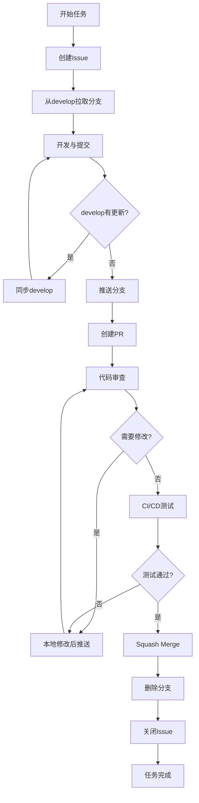

# Git协作流程规范

- [Git协作流程规范](#git协作流程规范)
  - [🎯 一、Git分支的本质理解](#-一git分支的本质理解)
    - [1.1 核心模型：时间线复制机](#11-核心模型时间线复制机)
    - [1.2 分支类型与命名规范](#12-分支类型与命名规范)
    - [1.3 与任务管理的关联](#13-与任务管理的关联)
  - [🔄 二、完整工作流程](#-二完整工作流程)
    - [2.1 准备工作：Git初始配置（新手必读）](#21-准备工作git初始配置新手必读)
    - [2.2 标准功能开发流程](#22-标准功能开发流程)
    - [2.3 为什么需要PR流程？](#23-为什么需要pr流程)
  - [🏗️ 三、系统架构与分支管理](#️-三系统架构与分支管理)
    - [3.1 架构师的角色](#31-架构师的角色)
    - [3.2 架构演进过程](#32-架构演进过程)
    - [3.3 CI/CD流程（即将启用）](#33-cicd流程即将启用)
  - [📋 四、提交规范与PR要求](#-四提交规范与pr要求)
    - [4.1 提交信息规范](#41-提交信息规范)
    - [4.2 PR（Pull Request）要求](#42-prpull-request要求)
      - [PR标题格式：](#pr标题格式)
      - [PR描述模板：](#pr描述模板)
  - [⚠️ 五、分支保护与协作约定](#️-五分支保护与协作约定)
    - [5.1 分支保护规则](#51-分支保护规则)
    - [5.2 同步与冲突解决流程](#52-同步与冲突解决流程)
      - [当develop有更新时：](#当develop有更新时)
      - [常用合并策略：](#常用合并策略)
    - [5.3 紧急修复流程（Hotfix）](#53-紧急修复流程hotfix)
  - [🛠️ 六、Git常用命令速查](#️-六git常用命令速查)
    - [6.1 分支操作](#61-分支操作)
    - [6.2 提交与推送](#62-提交与推送)
    - [6.3 同步与合并](#63-同步与合并)
    - [6.4 暂存与恢复](#64-暂存与恢复)
    - [6.5 标签与版本](#65-标签与版本)
  - [🚀 七、任务管理系统集成（待启用）](#-七任务管理系统集成待启用)
    - [7.1 Issue工作流设计](#71-issue工作流设计)
    - [7.2 分支命名与Issue关联](#72-分支命名与issue关联)
    - [7.3 PR与Issue联动](#73-pr与issue联动)
  - [🆘 八、常见问题与解决方案](#-八常见问题与解决方案)
    - [8.1 推送失败：分支保护](#81-推送失败分支保护)
    - [8.2 合并冲突](#82-合并冲突)
    - [8.3 误提交文件](#83-误提交文件)
    - [8.4 忘记切换分支就修改](#84-忘记切换分支就修改)
  - [📚 九、学习资源与最佳实践](#-九学习资源与最佳实践)
    - [9.1 推荐学习路径](#91-推荐学习路径)
    - [9.2 日常最佳实践](#92-日常最佳实践)
    - [9.3 团队协作守则](#93-团队协作守则)
  - [🔄 十、Git工作流程图解](#-十git工作流程图解)


## 🎯 一、Git分支的本质理解

### 1.1 核心模型：时间线复制机
- **不是文件夹复制**，而是**时间点复制**
- 每个分支都是从某个时间点分叉的独立时间线
- 切换分支 = 在时间线上跳跃，重写工作目录状态

### 1.2 分支类型与命名规范
```
main       → 已发布的时间线（生产环境）
develop    → 集成开发的时间线（相对稳定）
feature/*  → 功能开发的时间线（实验性）
bugfix/*   → 问题修复的时间线（针对性）
hotfix/*   → 紧急修复的时间线（救火性）
release/*  → 版本发布的时间线
demo       → 样本分支（演示环境）
archive    → 存档分支（历史记录）
```

**命名示例：**
```bash
# 功能分支
feature/user-login
feature/payment-integration

# 修复分支
bugfix/fix-login-error
hotfix/critical-security-fix

# 发布分支
release/v1.2.0
```

### 1.3 与任务管理的关联
- **每个分支对应一个明确的任务**（功能、修复、优化）
- **分支名应包含任务标识**（建议与Issue编号关联）
- 示例：`feature/PROJ-123-user-authentication`

---

## 🔄 二、完整工作流程

### 2.1 准备工作：Git初始配置（新手必读）
```bash
# 1. 设置全局用户信息
git config --global user.name "你的姓名"
git config --global user.email "你的邮箱@公司.com"

# 2. 设置默认编辑器（可选）
git config --global core.editor "code --wait"  # VS Code

# 3. 设置常用别名（可选但推荐）
git config --global alias.co checkout
git config --global alias.br branch
git config --global alias.ci commit
git config --global alias.st status
git config --global alias.unstage 'reset HEAD --'
```

### 2.2 标准功能开发流程
```bash
# 步骤1：从最新的开发线开始
git checkout develop
git pull origin develop

# 步骤2：创建功能分支（建议与Issue关联）
git checkout -b feature/功能简述
# 或 git checkout -b feature/PROJ-123-功能简述

# 步骤3：开发与提交
# 进行代码修改...
git add .                     # 或指定具体文件
git commit -m "feat: 功能描述 [#PROJ-123]"
# 提交信息格式见第4节

# 步骤4：定期同步develop更新（避免大冲突）
git checkout develop
git pull origin develop
git checkout feature/你的分支
git merge develop
# 如果有冲突，解决冲突后提交

# 步骤5：推送分支到远程
git push origin feature/你的分支

# 步骤6：创建Pull Request（PR）
# 在GitHub/GitLab等平台创建PR，目标分支：develop
```

### 2.3 为什么需要PR流程？
- **代码审查**：多人协作，保证代码质量
- **自动化检查**：CI/CD流程自动运行测试
- **知识共享**：团队成员了解代码变更
- **历史记录**：每个变更都有完整的讨论记录
- **分支保护**：`main`和`develop`分支已启用保护，禁止直接push

---

## 🏗️ 三、系统架构与分支管理

### 3.1 架构师的角色
- **不是写最多代码的人**，而是**设计蓝图的人**
- 在develop分支建立基础架构骨架
- 定义前后端接口契约和数据格式
- 维护代码质量和一致性标准

### 3.2 架构演进过程
```
develop分支（基础架构）
    ↓
+ 功能A（厨师A做菜）→ 合并 ← 功能B（厨师B做菜）
    ↓
增强架构（厨房升级改造）← PR审查
    ↓
+ 功能C + 功能D → 合并
    ↓
成熟架构（定期发布到main）
```

### 3.3 CI/CD流程（即将启用）
```
开发分支 → 推送 → 触发CI → 自动测试 → 通过 → PR可合并
          ↓              ↓
         失败           通知开发者
```

---

## 📋 四、提交规范与PR要求

### 4.1 提交信息规范
```
<类型>(<范围>): <描述> [<任务号>]

类型：
  feat      - 新功能
  fix       - 修复bug
  docs      - 文档更新
  style     - 代码格式调整（不影响功能）
  refactor  - 代码重构
  test      - 测试相关
  chore     - 构建过程或辅助工具的变动

示例：
  feat(login): 添加用户登录功能 [#PROJ-123]
  fix(payment): 修复支付金额计算错误 [#PROJ-456]
  docs(readme): 更新安装说明
```

### 4.2 PR（Pull Request）要求

#### PR标题格式：
```
[类型] 简要描述 [#任务号]
示例：
  [Feature] 用户登录功能 [#PROJ-123]
  [Bugfix] 修复首页加载慢的问题 [#PROJ-456]
```

#### PR描述模板：
```markdown
## 变更内容
- 修改了XX文件，实现了XX功能
- 添加了XX组件，优化了XX流程

## 关联任务
- 关闭 #任务号
- 关联 #任务号

## 测试情况
- [x] 本地测试通过
- [x] 单元测试通过
- [ ] 需要额外说明的测试情况

## 影响范围
- 影响模块：用户模块、支付模块
- 数据库变更：是/否（如需要，提供SQL）
- 配置变更：是/否（如需要，说明如何更新）

## 截图/录屏（如适用）

```

---

## ⚠️ 五、分支保护与协作约定

### 5.1 分支保护规则
- **main分支**：仅允许通过Release PR合并，且需要2个审查通过
- **develop分支**：仅允许通过PR合并，且需要至少1个审查通过
- **禁止**直接使用 `git push origin main` 或 `git push origin develop`
- 所有合并必须使用 **Squash Merge**（合并后保持提交历史整洁）

### 5.2 同步与冲突解决流程

#### 当develop有更新时：
```bash
# 1. 暂存当前更改（如有未提交的修改）
git stash

# 2. 更新本地develop
git checkout develop
git pull origin develop

# 3. 回到功能分支并合并
git checkout feature/你的分支
git merge develop

# 4. 解决冲突（如有）
# 冲突文件会显示 <<<<<<< HEAD ... >>>>>>> develop
# 手动编辑文件解决冲突后：
git add .
git commit -m "merge: 同步develop更新"

# 5. 恢复暂存的更改
git stash pop
# 如有冲突，继续解决
```

#### 常用合并策略：
```bash
# 方案A：合并（保留完整历史）
git merge origin/develop

# 方案B：变基（更整洁的历史）
git rebase origin/develop

# 推荐新手使用merge，熟悉后再尝试rebase
```

### 5.3 紧急修复流程（Hotfix）
```bash
# 1. 从main创建修复分支
git checkout main
git pull origin main
git checkout -b hotfix/紧急问题描述

# 2. 修复并测试
# ... 修复代码 ...
git add .
git commit -m "fix: 紧急修复XX问题"

# 3. 同时合并到main和develop
git checkout main
git merge hotfix/xxx  # 通过PR
git checkout develop
git merge hotfix/xxx  # 通过PR
```

---

## 🛠️ 六、Git常用命令速查

### 6.1 分支操作
```bash
# 查看分支
git branch           # 本地分支
git branch -r        # 远程分支
git branch -a        # 所有分支

# 创建与切换
git checkout -b feature/xxx      # 创建并切换
git branch feature/xxx           # 只创建
git checkout feature/xxx         # 只切换

# 删除分支
git branch -d feature/xxx        # 删除本地分支
git push origin --delete feature/xxx  # 删除远程分支
```

### 6.2 提交与推送
```bash
# 查看状态
git status
git diff                     # 查看未暂存的修改
git diff --staged           # 查看已暂存的修改

# 提交
git add .                    # 添加所有更改
git add path/to/file        # 添加特定文件
git commit -m "描述"         # 提交到本地仓库
git commit --amend          # 修改上次提交（未推送前）

# 推送
git push origin branch-name  # 首次推送
git push                    # 后续推送（如果已设置上游）
```

### 6.3 同步与合并
```bash
# 获取远程更新
git fetch origin            # 仅下载，不合并
git pull origin develop     # 下载并合并（= fetch + merge）

# 合并分支
git merge origin/develop    # 合并到当前分支
git rebase origin/develop   # 变基到当前分支

# 查看合并状态
git log --oneline --graph   # 图形化查看历史
```

### 6.4 暂存与恢复
```bash
# 暂存当前修改
git stash                   # 暂存所有未提交修改
git stash save "描述"       # 带描述暂存
git stash list              # 查看暂存列表

# 恢复暂存
git stash apply stash@{0}   # 恢复但不删除
git stash pop               # 恢复并删除最近一次
git stash drop stash@{0}    # 删除指定暂存

# 撤销操作
git reset --soft HEAD^      # 撤销提交，保留更改
git reset --hard HEAD^      # 撤销提交，丢弃更改
git checkout -- file        # 撤销文件更改
```

### 6.5 标签与版本
```bash
# 创建标签（用于发布）
git tag v1.0.0              # 轻量标签
git tag -a v1.0.0 -m "版本说明"  # 附注标签

# 推送标签
git push origin v1.0.0      # 推送单个标签
git push origin --tags      # 推送所有标签
```

---

## 🚀 七、任务管理系统集成（待启用）

### 7.1 Issue工作流设计
```
1. 创建Issue → 分配负责人 → 设置标签
2. 开发：创建对应分支 → 开发 → 提交（关联Issue）
3. 测试：创建测试任务 → 验证 → 反馈
4. 完成：PR合并 → 关闭Issue
```

### 7.2 分支命名与Issue关联
```bash
# 推荐格式：类型/项目编号-简要描述
feature/PROJ-123-user-login
bugfix/PROJ-456-fix-crash
hotfix/PROJ-789-security-patch

# 提交时自动关闭Issue
git commit -m "feat: 实现登录功能，关闭 #123"
# 在PR合并后，Issue #123会自动关闭
```

### 7.3 PR与Issue联动
- PR描述中使用 `close #123` 或 `fix #123`
- 一个PR可以关联多个Issue
- CI/CD通过后自动更新Issue状态

---

## 🆘 八、常见问题与解决方案

### 8.1 推送失败：分支保护
```
错误：! [remote rejected] develop -> develop (protected branch hook declined)
解决：develop是保护分支，请创建PR，不要直接push
```

### 8.2 合并冲突
```
1. 先拉取最新代码：git pull origin develop
2. 解决冲突文件（搜索 <<<<<<<）
3. 标记已解决：git add .
4. 继续合并：git commit
```

### 8.3 误提交文件
```
# 1. 从暂存区移除（不删除文件）
git reset HEAD file.txt

# 2. 从版本控制移除（删除文件）
git rm --cached file.txt

# 3. 彻底移除（包括本地文件）
git rm file.txt
```

### 8.4 忘记切换分支就修改
```
# 已修改但未提交
git stash
git checkout correct-branch
git stash pop

# 已提交到错误分支
git checkout wrong-branch
git reset HEAD^ --soft       # 撤销提交但保留更改
git stash
git checkout correct-branch
git stash pop
git add .
git commit -m "正确的提交"
```

---

## 📚 九、学习资源与最佳实践

### 9.1 推荐学习路径
1. **新手**：掌握6.1-6.3节命令，按2.2节流程操作
2. **进阶**：学习rebase、stash、cherry-pick等高级操作
3. **精通**：理解git内部原理（objects、refs、hooks）

### 9.2 日常最佳实践
- **勤提交**：小步快跑，每次提交只做一件事
- **勤同步**：每天开始工作前先pull最新代码
- **写清楚**：提交信息要具体，方便追溯
- **早提PR**：功能完成70%就可以提PR，边审查边完善
- **善用标签**：重要版本一定要打标签

### 9.3 团队协作守则
1. 不直接push到保护分支
2. PR前先自我审查，确保代码质量
3. 及时Review同事的PR（24小时内）
4. 合并后立即删除已合并的分支
5. 遇到问题先查文档，再问同事

---

## 🔄 十、Git工作流程图解



---

**最后更新日期：** 2026年11月  
**适用对象：** 所有开发团队成员  
**文档维护：** 团队负责人定期更新此文档

> 提示：首次阅读请重点学习第二、四、六节，日常开发中可将第六节作为速查表使用。